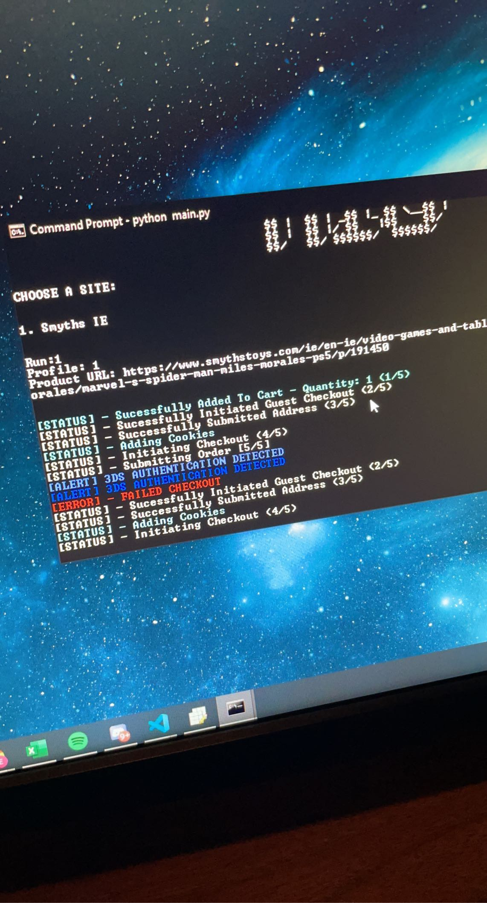

# eddieaio
In February of 2021 I started this project, during this time there was a large Games Console shortage (PS5 and Xbox One) shortage. The goal of this script was to checkout these items as they became available on Smyths IE.

This project was difficult due to the learning curve of learning threading, reading from a CSV file, selenium and learning how to make Python scripts call eachother.

This script is no longer functional due to Smyths IE the website changing how it functions, the reason for this is because of scripts like this existed and took advantage of its checkout flow. This script would use post requests to add the product to basket as soon as it became available to purchase.

One of the functions that I am very proud of to have achieved is that the amount of threads ran is depending on the amount of lines in the CSV file, allowing the process to be very user friendly. Once details were entered in to the 'profiles.csv' and the script was started that is all the user would of needed to do.

## How to run
```bash
python3 EddieAIO.py
```

## Early Example photo of CLI


## Videos of Script working in 2021.


